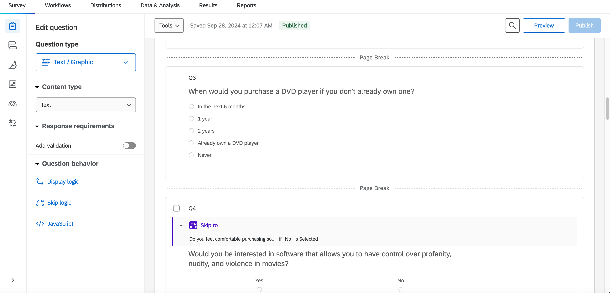

Using Qualtrics, an online survey platform, to apply sound survey design principles provides a valuable opportunity to practice fundamental social research techniques. Below, I\'ll describe a sample survey, inspired by pedagogical goals, which was designed for distribution through Qualtrics.

To start, I downloaded the 'Movie Rental' .qsf file from GitHub, then uploaded it and imported it into a new survey project with the same name. I customized the survey by adding page breaks, updating the design with a fresh theme, and implementing skip logic to create dependencies between questions.

The survey starts with with questions about movie preferences and viewing habits, followed by demographic questions at the end. This is a standard approach because placing routine or less engaging questions at the end tends to improve response rates by keeping participants interested throughout the survey.
