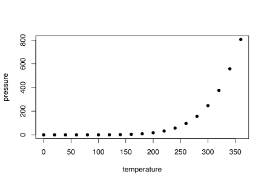
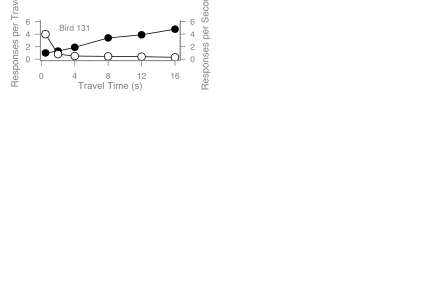
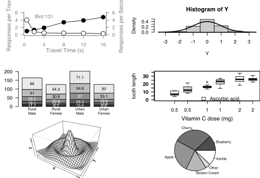

```{r}
# Histogram
# Random data
Y <- rnorm(50)
# Make sure no Y exceed [-3.5, 3.5]
Y[Y < -3.5 | Y > 3.5] <- NA # Selection/set range
x <- seq(-3.5, 3.5, .1)
dn <- dnorm(x)
par(mar=c(4.5, 4.1, 3.1, 0))
hist(Y, breaks=seq(-3.5, 3.5), ylim=c(0, 0.5), 
     col="gray80", freq=FALSE)
lines(x, dnorm(x), lwd=2)
par(mar=c(5.1, 4.1, 4.1, 2.1))


```

```{r}
# Barplot
par(mar=c(2, 3.1, 2, 2.1)) 
midpts <- barplot(VADeaths, 
                  col=gray(0.1 + seq(1, 9, 2)/11), 
                  names=rep("", 4))
mtext(sub(" ", "\n", colnames(VADeaths)),
      at=midpts, side=1, line=0.5, cex=0.5)
text(rep(midpts, each=5), apply(VADeaths, 2, cumsum) - VADeaths/2,
     VADeaths, 
     col=rep(c("white", "black"), times=3:2), 
     cex=0.8)
par(mar=c(5.1, 4.1, 4.1, 2.1))  
```

```{r}
# Boxplot
par(mar=c(3, 4.1, 2, 0))
boxplot(len ~ dose, data = ToothGrowth,
        boxwex = 0.25, at = 1:3 - 0.2,
        subset= supp == "VC", col="white",
        xlab="",
        ylab="tooth length", ylim=c(0,35))
mtext("Vitamin C dose (mg)", side=1, line=2.5, cex=0.8)
boxplot(len ~ dose, data = ToothGrowth, add = TRUE,
        boxwex = 0.25, at = 1:3 + 0.2,
        
        subset= supp == "OJ")
legend(1.5, 9, c("Ascorbic acid", "Orange juice"), 
       fill = c("white", "gray"), 
       bty="n")
par(mar=c(5.1, 4.1, 4.1, 2.1))
```

```{r}
# Persp
x <- seq(-10, 10, length= 30)
y <- x
f <- function(x,y) { r <- sqrt(x^2+y^2); 10 * sin(r)/r }
z <- outer(x, y, f)
z[is.na(z)] <- 1
# 0.5 to include z axis label
par(mar=c(0, 0.5, 0, 0), lwd=0.5)
persp(x, y, z, theta = 30, phi = 30, 
      expand = 0.5)
par(mar=c(5.1, 4.1, 4.1, 2.1), lwd=1)

# Piechart
par(mar=c(0, 2, 1, 2), xpd=FALSE, cex=0.5)
pie.sales <- c(0.12, 0.3, 0.26, 0.16, 0.04, 0.12)
names(pie.sales) <- c("Blueberry", "Cherry",
                      "Apple", "Boston Cream", "Other", "Vanilla")
pie(pie.sales, col = gray(seq(0.3,1.0,length=6))) 
```
