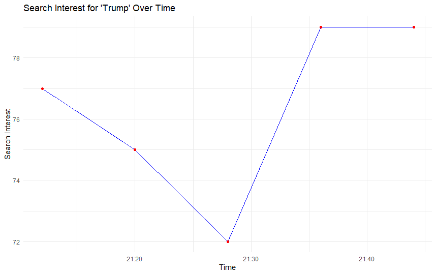
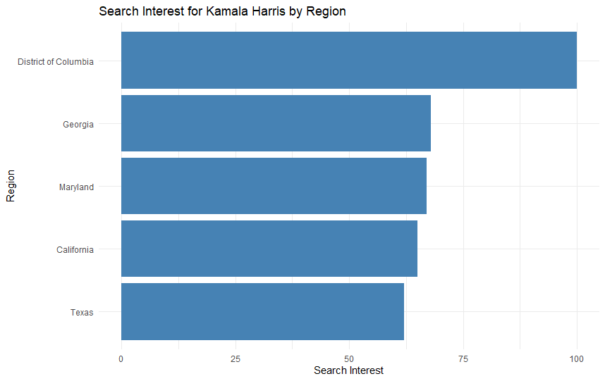

As we can note the search in trump sees a harsh low and a harsh high between 21.25h and 21.35h

As we can see the above visualization of the search of Kamala Harris over the states in the United States of America. The district of Columbia has the highest searches followed by Georgia, Maryland, California and Texas. It would be interesting to find why these countries.
